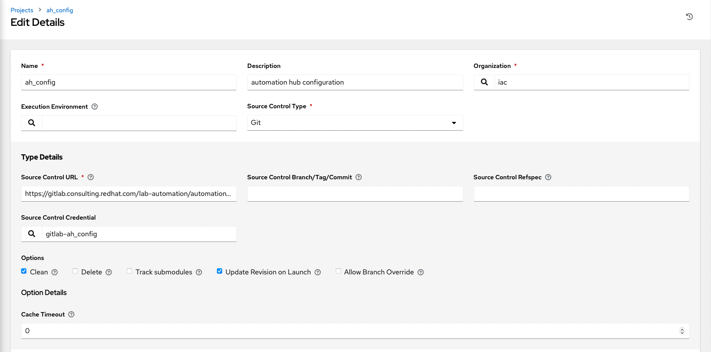
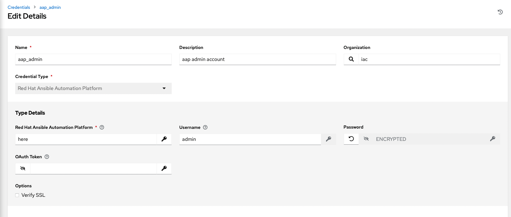

# Intro

In this section, you will only be given a summary of the objects you need to create along with some screenshots of a controller that is configured with the completed code. You will also be provided the variables sections from the readme's for each of the required roles to help you complete this task.

## Step 1

Projects

## Step 2

Creds

## Step 3

Inventories

## Step 4

Inventory sources

## Step 5

Templates

