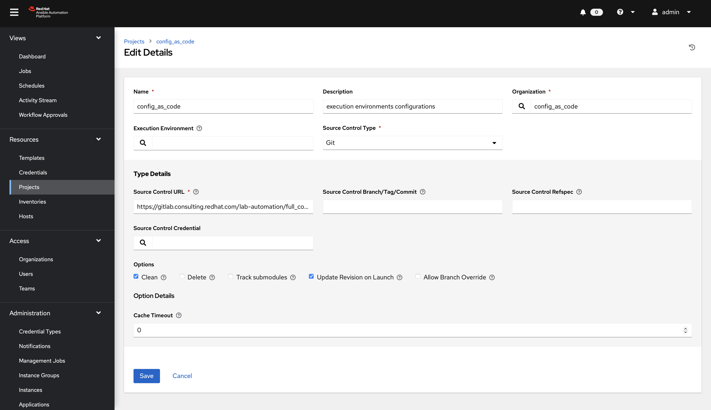
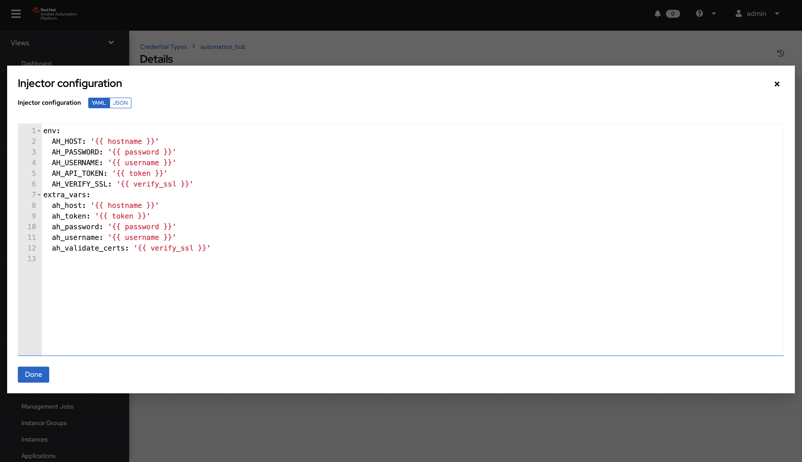
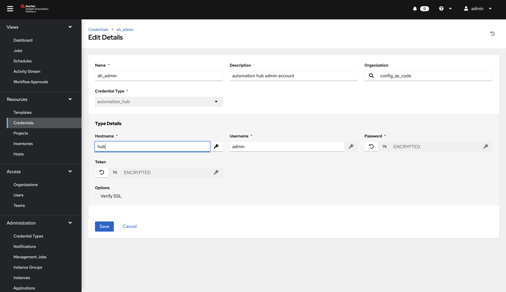
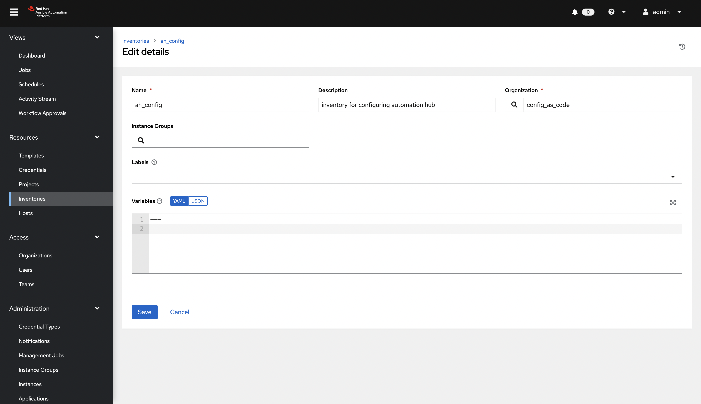
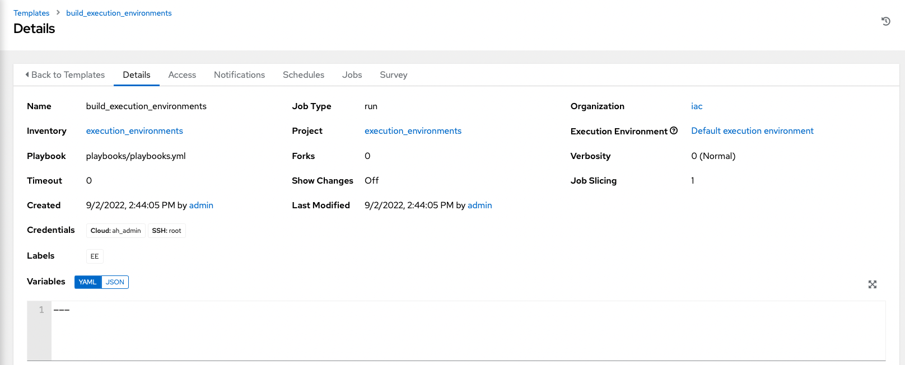
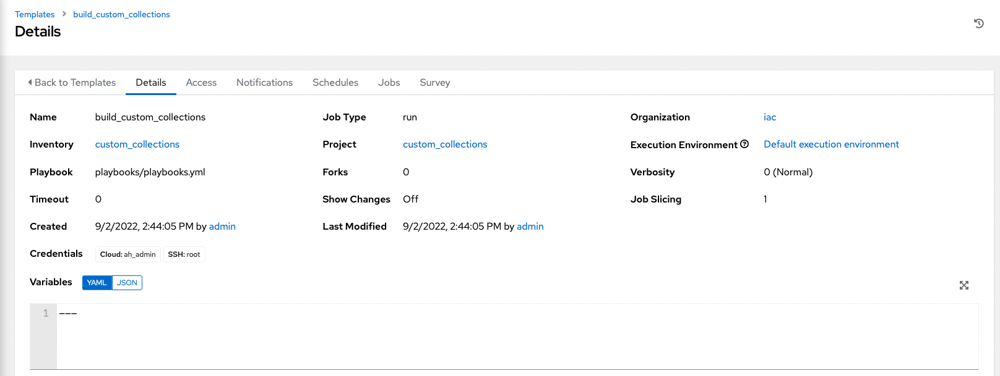
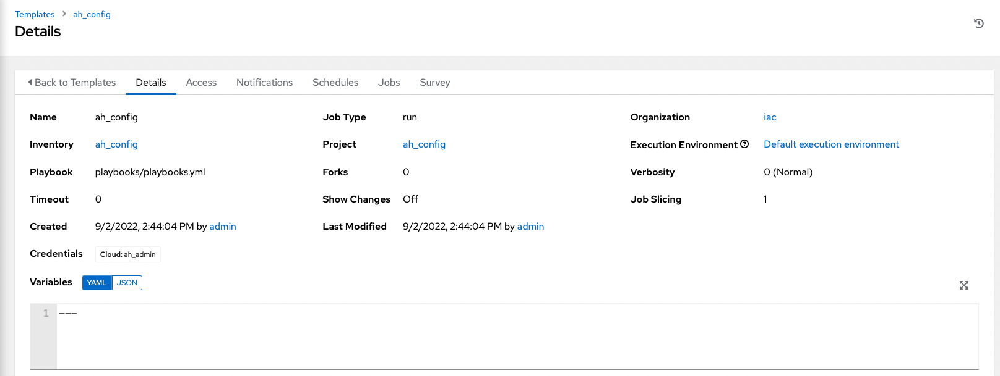
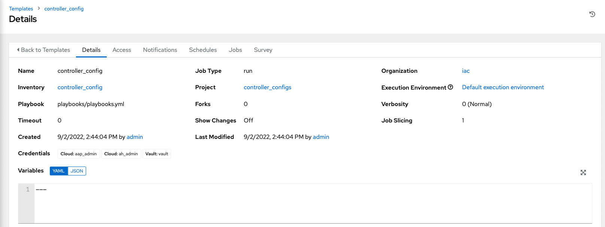

# Intro

In this section, you will only be given a summary of the objects you need to create along with some screenshots of a controller that is configured with the completed code. You will also be provided the variables sections from the readme's for each of the required roles to help you complete this task.

## Step 1

Create a file `group_vars/all/projects.yml` and add the required information to the list `controller_projects` to configure the UI to look like the screenshot.

### What git project are we pointing at

```yaml
---
controller_projects:

...
```



Further documentation for those who are interested to learn more see:

- [projects role](https://github.com/redhat-cop/controller_configuration/blob/devel/roles/projects/README.md)

## Step 2

Create a file `group_vars/all/credential_types.yml` and add the required information to the list `controller_credential_types` to configure the UI to look like the screenshot

Make sure to keep the ssh_priv_file credential type.

```yaml
---
controller_credential_types:
  - name: ssh_priv_file
    kind: cloud
    description: creates temp ssh priv key to use (cannot have passphrase)
    inputs:
      fields:
        - id: priv_key
          type: string
          label: Certificate
          format: ssh_private_key
          multiline: true
          secret: true
    injectors:
      env:
        MY_CERT_FILE_PATH: !unsafe '{{ tower.filename.cert_file }}'
      file:
        template.cert_file: !unsafe '{{ priv_key }}'
...
```




Further documentation for those who are interested to learn more see:

- [credential types role](https://github.com/redhat-cop/controller_configuration/blob/devel/roles/credential_types/README.md)

## Step 3

Create a file `group_vars/all/credentials.yml` and add the required information to the list `controller_credentials` to configure the UI to look like the screenshot

```yaml
---
controller_credentials:
  - name: aap_admin
    credential_type: Red Hat Ansible Automation Platform
    organization: config_as_code
    description: aap admin account
    inputs:
      host: "{{ controller_hostname }}"
      username: "{{ controller_username }}"
      password: "{{ controller_password }}"
      verify_ssl: false

  - name: ah_token_user
    credential_type: automation_hub
    organization: config_as_code
    description: automation hub api account
    inputs:
      hostname: "{{ ah_host }}"
      username: "{{ ah_token_username }}"
      token: "{{ ah_token }}"
      verify_ssl: false

  - name: ah_certified
    credential_type: Ansible Galaxy/Automation Hub API Token
    organization: config_as_code
    inputs:
      url: "https://{{ ah_host }}/api/galaxy/content/rh-certified/"
      token: "{{ ah_token }}"

  - name: ah_published
    credential_type: Ansible Galaxy/Automation Hub API Token
    organization: config_as_code
    inputs:
      url: "https://{{ ah_host }}/api/galaxy/content/published/"
      token: "{{ ah_token }}"

  - name: ah_community
    credential_type: Ansible Galaxy/Automation Hub API Token
    organization: config_as_code
    inputs:
      url: "https://{{ ah_host }}/api/galaxy/content/community/"
      token: "{{ ah_token }}"

  - name: cr_ah
    credential_type: Container Registry
    organization: config_as_code
    inputs:
      host: "{{ ah_host }}"
      username: "{{ ah_username }}"
      password: "{{ ah_password }}"
      verify_ssl: false

# might need to change for the student account
  - name: root
    credential_type: Machine
    organization: config_as_code
    description: root local password
    inputs:
      username: root
      password: "{{ root_machine_pass }}"

  - name: vault
    credential_type: Vault
    organization: config_as_code
    description: vault password
    inputs:
      vault_password: "{{ vault_pass }}"
...
```




Further documentation for those who are interested to learn more see:

- [credentials role](https://github.com/redhat-cop/controller_configuration/blob/devel/roles/credentials/README.md)

## Step 4

Create a file `group_vars/all/inventories.yml` and add the required information to the list `controller_inventories` to configure the UI to look like the screenshot

```yaml
---
controller_inventories:

...
```



Further documentation for those who are interested to learn more see:

- [inventories role](https://github.com/redhat-cop/controller_configuration/blob/devel/roles/inventories/README.md)

## Step 5

Create a file `group_vars/all/inventory_sources.yml` and add the required information to the list `controller_inventory_sources` to configure the UI to look like the screenshot
**WE never declared an inventory files here yet, and never declared the env variable**

```yaml
---
controller_inventory_sources:

...
```


Further documentation for those who are interested to learn more see:

- [inventory sources role](https://github.com/redhat-cop/controller_configuration/blob/devel/roles/inventory_sources/README.md)

## Step 6

Create a file `group_vars/all/job_templates.yml` and add the required information to the list `controller_templates` to configure the UI to look like the screenshot

Pay attention to the credentials attached to each job template.

**remove labels from the example for build_execution_environment image**
**need example project to test this as job templates not matching playbook causing failure**

```yaml
---
controller_templates:

...
```






Further documentation for those who are interested to learn more see:

- [job templates role](https://github.com/redhat-cop/controller_configuration/blob/devel/roles/job_templates/README.md)

## Step 7

Create a playbook `controller_config.yml`



```yaml
---
- name: Playbook to configure ansible controller post installation
  hosts: all
  vars_files:
    - "vault.yml"
  connection: local
  tasks:
    - name: include setting role
      ansible.builtin.include_role:
        name: redhat_cop.controller_configuration.settings
      when: controller_settings | length is not match('0')

    - name: create organizations without credentials
      ansible.builtin.set_fact:
        orgs_no_creds: "{{ orgs_no_creds | default([]) + [{ 'name' : item.name }] }}"
      loop: "{{ controller_organizations }}"
      when:
        - controller_organizations | length is not match('0')
        - (item.state | default('Present')) != 'absent'

    - name: print out custom fact
      ansible.builtin.debug:
        var: orgs_no_creds
        verbosity: 2

    - name: include organization role
      ansible.builtin.include_role:
        name: redhat_cop.controller_configuration.organizations
      vars:
        controller_organizations: "{{ orgs_no_creds }}"
      when: orgs_no_creds | length is not match('0')

    - name: include labels role
      ansible.builtin.include_role:
        name: redhat_cop.controller_configuration.labels
      when: controller_labels | length is not match('0')

    - name: include users role
      ansible.builtin.include_role:
        name: redhat_cop.controller_configuration.users
      vars:
        controller_configuration_users_secure_logging: true
      when: controller_user_accounts | length is not match('0')

    - name: include teams role
      ansible.builtin.include_role:
        name: redhat_cop.controller_configuration.teams
      when: controller_teams | length is not match('0')

   # probably not optimal but works, looking for better solutions
    - name: Figuring out AH token
      block:
        - name: Authenticate and get an API token from Automation Hub
          redhat_cop.ah_configuration.ah_token:
            ah_host: "{{ ah_host | default(groups['automationhub'][0]) }}"
            ah_username: "{{ ah_token_username | default('admin') }}"
            ah_password: "{{ ah_token_password }}"
            ah_path_prefix: 'galaxy' # this is for private automation hub
            ah_verify_ssl: false
          register: r_ah_token

        - name: Fixing format
          ansible.builtin.set_fact:
            ah_token: "{{ ah_token['token'] }}"
          when: r_ah_token['changed']
      when: ah_token is not defined or ah_token['token'] is defined

    - name: include credential_types role
      ansible.builtin.include_role:
        name: redhat_cop.controller_configuration.credential_types
      when: controller_credential_types | length is not match('0')

    - name: include credential role
      ansible.builtin.include_role:
        name: redhat_cop.controller_configuration.credentials
      vars:
        controller_configuration_credentials_secure_logging: true
      when: controller_credentials | length is not match('0')

    - name: include credential_input_sources role
      ansible.builtin.include_role:
        name: redhat_cop.controller_configuration.credential_input_sources
      when: controller_credential_input_sources | length is not match('0')

    - name: include organizations role
      ansible.builtin.include_role:
        name: redhat_cop.controller_configuration.organizations
      when: controller_organizations | length is not match('0')

    - name: include execution_environments role
      ansible.builtin.include_role:
        name: redhat_cop.controller_configuration.execution_environments
      when: controller_execution_environments | length is not match('0')

    - name: include projects role
      ansible.builtin.include_role:
        name: redhat_cop.controller_configuration.projects
      when: controller_projects | length is not match('0')

    - name: include inventories role
      ansible.builtin.include_role:
        name: redhat_cop.controller_configuration.inventories
      when: controller_inventories | length is not match('0')

    - name: include inventory_sources role
      ansible.builtin.include_role:
        name: redhat_cop.controller_configuration.inventory_sources
      when: controller_inventory_sources | length is not match('0')

    - name: include inventory_source_update role
      ansible.builtin.include_role:
        name: redhat_cop.controller_configuration.inventory_source_update

    - name: include groups role
      ansible.builtin.include_role:
        name: redhat_cop.controller_configuration.groups
      when: controller_groups | length is not match('0')

    - name: include applications role
      ansible.builtin.include_role:
        name: redhat_cop.controller_configuration.applications
      when: controller_applications | length is not match('0')

    - name: include job_templates role
      ansible.builtin.include_role:
        name: redhat_cop.controller_configuration.job_templates
      when: controller_templates | length is not match('0')

    - name: include workflow_job_templates role
      ansible.builtin.include_role:
        name: redhat_cop.controller_configuration.workflow_job_templates
      when: controller_workflows | length is not match('0')

    - name: include schedules role
      ansible.builtin.include_role:
        name: redhat_cop.controller_configuration.schedules
      when: controller_schedules | length is not match('0')

    - name: include roles role
      ansible.builtin.include_role:
        name: redhat_cop.controller_configuration.roles
      when: controller_roles | length is not match('0')
...
```


